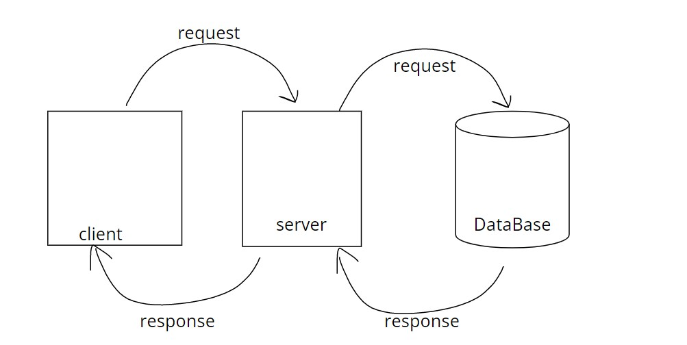

# Movies-Library
# Project Name - Project Version

**Author Name**: Farah Yasin

## WRRC

## Overview

## Getting Started

-Create a route with a method of get and a path of for the trending
-create a route for search page
-create a route for TV list page
-create a route for popular page
-create a constructore to retrieve some data from data.json
-use the app.use()
-create a functions to handel errors like error 404 and error 500
-connecting the server to database
-create a route for addMovie
-create functions to post movies and get this movies again

## Project Features
My app include some data from Movies in home page and welcome massage inside favorite page,and show the trending, and search, and show TV list, and show the most popular movies, now we can add movie and get this movie