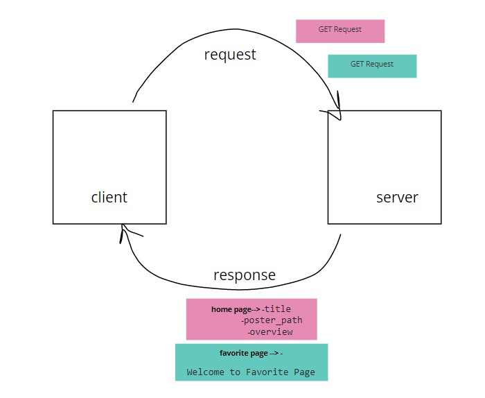

# Movies-Library
# Project Name - Project Version

**Author Name**: Farah Yasin

## WRRC

## Overview

## Getting Started
<!-- What are the steps that a user must take in order to build this app on their own machine and get it running? -->
-Create a route with a method of get and a path of for the home page
-create a route for favorite page
-create a constructore to retrieve some data from data.json
-use the app.use()
-create a functions to handel errors like error 404 and error 500

## Project Features
My app include some data from Movies in home page and welcome massage inside favorite page